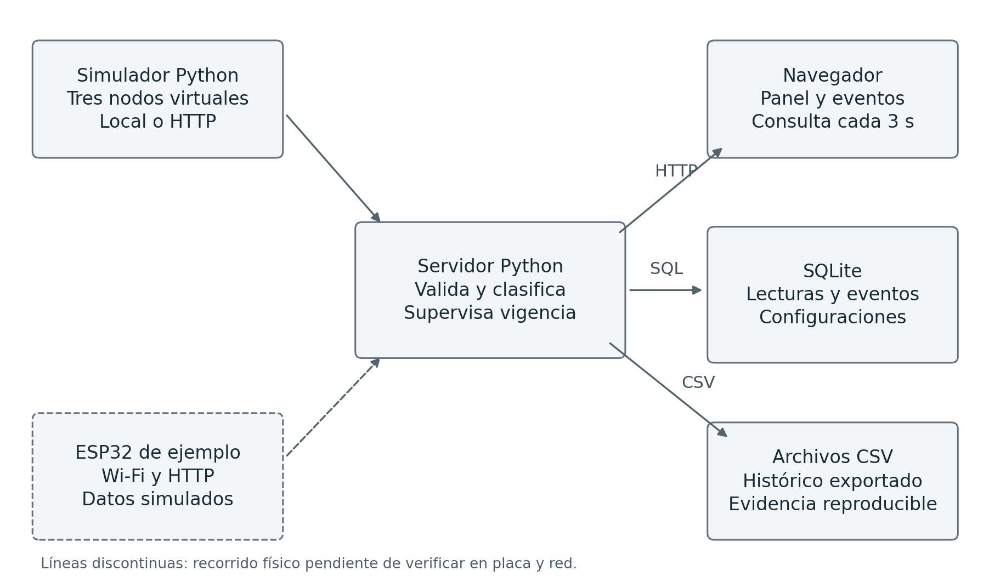

# Anexo E Arquitectura de la solución

La entrega separa fuentes de telemetría, procesamiento, almacenamiento y consulta. La simulación integrada permite iniciar el sistema sin hardware. El emisor HTTP y el ejemplo ESP32 utilizan el mismo contrato de datos, aunque el recorrido físico del segundo todavía requiere verificación.

Figura E1. Arquitectura de la versión académica de CANARI. Elaboración propia.

## Relaciones de almacenamiento

Una lectura pertenece a un nodo y a una configuración identificada por hash. Un evento puede asociarse a una lectura; los eventos de ausencia de datos también pueden registrarse sin ella. node_state conserva la última transición conocida para evitar que una misma condición genere registros repetidos.

## Decisiones de diseño

La topología lógica es centralizada. El computador conserva la base y entrega la interfaz; la consulta local no depende de una conexión a Internet. La demostración Wi-Fi utiliza un punto de acceso de laboratorio. No se implementa una red LoRa ni se presupone cobertura entre galerías. La API ofrece un punto de integración posterior para un adaptador de instrumento o una pasarela apropiada.

